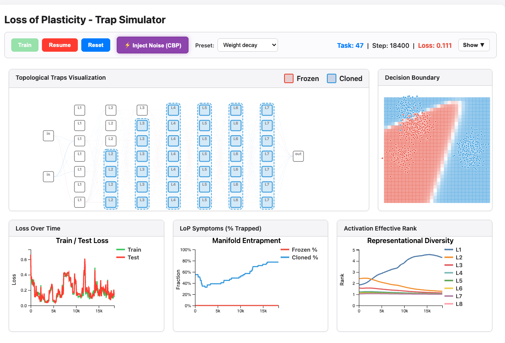

# Barriers for Learning in an Evolving World: Mathematical Understanding of Loss of Plasticity

**ICLR 2026** · Continual Learning · Loss of Plasticity · Gradient Dynamics · Invariant Manifolds

[Paper / OpenReview](https://openreview.net/forum?id=g6kof5fSba) · [Interactive Demo](https://ajoudaki.github.io/loss-of-plasticity/demo/demo.html) · [Code](https://github.com/ajoudaki/loss-of-plasticity) · [License](LICENSE.md)

This repository contains the code, experiments, and interactive demo for our ICLR 2026 paper:

> **Barriers for Learning in an Evolving World: Mathematical Understanding of Loss of Plasticity**

Loss of Plasticity (LoP) is the failure mode where a neural network does not merely forget old tasks, but loses the ability to learn new ones. We study LoP through a dynamical-systems lens: gradient descent can become trapped in invariant submanifolds of parameter space.

We identify two concrete trap mechanisms:

- **Frozen units**: units saturate, gradients vanish, and incoming parameters stop adapting.
- **Cloned units**: redundant units receive matching forward and backward signals, causing their gradients to remain identical.

We further connect the emergence of these traps to a **rank-plasticity tension**: the same feature-learning dynamics that help networks form compact representations on the current task can push them toward low-dimensional structures that reduce future adaptability.

---

## Interactive demo

[](https://ajoudaki.github.io/loss-of-plasticity/demo/demo.html)

**Live demo:** https://ajoudaki.github.io/loss-of-plasticity/demo/demo.html

The demo runs entirely in the browser. A small MLP trains on a continually shifting 2D distribution while the interface visualizes, in real time:

- frozen/dead units,
- cloned/duplicate units,
- activation effective rank,
- train/test loss,
- and the fraction of units trapped in LoP-like states.

Use the **Preset** dropdown to compare different regimes. The default drifting setting often produces frozen units, while the weight-decay setting can make cloned/duplicate units visible. The **Inject Noise** button illustrates how symmetry-breaking perturbations can push the model away from an LoP manifold.

Source: [`demo/demo.html`](demo/demo.html)

---

## Core mathematical idea

A Loss-of-Plasticity state can be an invariant manifold.

A submanifold $M \subset \Theta$ is a trap if, for every training sample,

$$
\nabla_\theta \ell(\theta; x,y) \in T_\theta M
\qquad
\forall \theta \in M.
$$

For affine manifolds, this means GD/SGD cannot leave once it enters.

### Frozen-unit trap

If a unit is saturated,

$$
\phi'(z_v) = 0,
$$

then its backpropagated signal vanishes, so incoming parameters stop receiving useful gradients. This creates an affine frozen-unit manifold.

### Cloned-unit trap

Partition units into blocks $S_i$. If every block $W[S_i,S_j]$ has equal row sums and equal column sums, then units inside the same block have identical forward and backward signals:

$$
h_u = h_{u'},
\qquad
\delta_v = \delta_{v'}.
$$

Therefore edge gradients are identical:

$$
\frac{\partial \ell}{\partial W_{uv}} = h_u \delta_v = h_{u'} \delta_{v'} =
\frac{\partial \ell}{\partial W_{u'v'}}.
$$

So the gradient is block-constant, tangent to the cloned affine subspace, and training preserves the clone structure.

### Why do these traps form?

For a nonlinear activation acting on a preactivation correlation matrix $C$,

$$
\frac{\mathrm{er}_2(K_\phi(C))}{\mathrm{er}_2(C)}
\ge
1+
\gamma_\phi
\frac{\Psi(C)}{\|C\|_F^2},
$$

where

$$
\gamma_\phi = \frac{1-K'_\phi(0)}{1+K'_\phi(0)}, \qquad \Psi(C) =
\sum_{i\ne j} C_{ij}^2(1-C_{ij}^2).
$$

Interpretation:

$$
\text{rank gain}
\approx
\text{activation decorrelation strength}
\times
\text{remaining correlation potential}.
$$

Thus nonlinear feature learning consumes intermediate correlations and increases effective rank. But task optimization often pushes representations toward low-rank compression. This creates two degeneracy routes:

$$
\Psi(C)\to 0
\Rightarrow
C_{ij}\in\{0,\pm1\}
\Rightarrow
\text{orthogonal or duplicate features},
$$

and

$$
\gamma_\phi\to 1
\Rightarrow
\phi'(z)\approx 0
\Rightarrow
\text{frozen/dead units}.
$$

In short:

$$
\text{feature learning creates duplicates/frozen units}
$$

$$
\Downarrow
$$

$$
\text{duplicates/frozen units create invariant GD traps}
$$

$$
\Downarrow
$$

$$
\text{the network keeps training, but with fewer degrees of freedom.}
$$

That is Loss of Plasticity.

---

## What this repository contains

- Interactive browser demo for visualizing LoP traps.
- Continual-learning experiments across task sequences.
- Neural-network cloning experiments for MLPs, CNNs, ResNets, and ViTs.
- Metrics for frozen, duplicate, saturated, and low-rank representations.
- Hydra configs for reproducible experiment runs.
- Utilities for monitoring effective rank, activation similarity, and plasticity-related symptoms.

---

## Installation

Clone the repository:

```bash
git clone https://github.com/ajoudaki/loss-of-plasticity
cd loss-of-plasticity
```

Install dependencies:

```bash
pip install -r requirements.txt
```

Optional: download Tiny ImageNet.

```bash
python scripts/download_tiny_imagenet.py
```

The browser demo has no Python dependency. You can either use the hosted version or open [`demo/demo.html`](demo/demo.html) locally.

---

## Quickstart

Run the default experiment:

```bash
python scripts/run_experiment.py
```

Run a continual-learning experiment:

```bash
python scripts/run_experiment.py training=continual dataset=tiny_imagenet model=mlp
```

Run a cloning experiment:

```bash
python scripts/run_experiment.py training=cloning model=mlp dataset=cifar10
```

Enable Weights & Biases logging:

```bash
python scripts/run_experiment.py logging.use_wandb=true
```

Run a small dry run to test your setup:

```bash
python scripts/run_experiment.py training.epochs_per_task=2 dryrun=true
```

---

## Reproducing experiments

The codebase uses [Hydra](https://hydra.cc/) for configuration management. Experiments can be modified through composable command-line overrides.

### Continual learning

```bash
# MLP on Tiny ImageNet continual learning
python scripts/run_experiment.py training=continual model=mlp dataset=tiny_imagenet

# CNN on Tiny ImageNet continual learning
python scripts/run_experiment.py training=continual model=cnn dataset=tiny_imagenet

# ResNet on Tiny ImageNet continual learning
python scripts/run_experiment.py training=continual model=resnet dataset=tiny_imagenet

# ViT on Tiny ImageNet continual learning
python scripts/run_experiment.py training=continual model=vit dataset=tiny_imagenet
```

### Cloning experiments

Cloning experiments proceed in two phases:

1. Train a base model.
2. Expand the model by duplicating units/channels/features.
3. Continue training the base and cloned models while tracking loss, effective rank, and cloning metrics.

```bash
# MLP cloning
python scripts/run_experiment.py training=cloning model=mlp dataset=cifar10

# CNN cloning
python scripts/run_experiment.py training=cloning model=cnn dataset=cifar10

# ResNet cloning
python scripts/run_experiment.py training=cloning model=resnet dataset=cifar10

# ViT cloning
python scripts/run_experiment.py training=cloning model=vit dataset=cifar10
```

Custom cloning settings:

```bash
python scripts/run_experiment.py training=cloning model=resnet dataset=cifar10 \
  training.initial_epochs=30 \
  training.epochs_per_expansion=30 \
  training.expansion_factor=2 \
  training.num_expansions=2
```

### Helper script for cloning experiments

```bash
# Make executable if needed
chmod +x scripts/run_cloning_experiment.sh

# Basic MLP experiment
./scripts/run_cloning_experiment.sh mlp-mnist

# CNN experiment
./scripts/run_cloning_experiment.sh cnn-cifar10

# ResNet experiment
./scripts/run_cloning_experiment.sh resnet-cifar10

# Vision Transformer experiment
./scripts/run_cloning_experiment.sh vit-cifar10

# Multiple expansion cycles
./scripts/run_cloning_experiment.sh multi-expansion

# View all options
./scripts/run_cloning_experiment.sh --help
```

---

## Available configurations

### Models

```bash
model=mlp
model=cnn
model=resnet
model=vit
```

### Datasets

```bash
dataset=mnist
dataset=cifar10
dataset=cifar100
dataset=tiny_imagenet
```

### Optimizers

```bash
optimizer=adam
optimizer=sgd
optimizer=rmsprop
```

### Training modes

```bash
training=standard
training=continual
training=cloning
```

### Common overrides

```bash
# Change optimizer and learning rate
python scripts/run_experiment.py optimizer=sgd optimizer.lr=0.01

# Change batch size
python scripts/run_experiment.py training.batch_size=64

# Change number of continual-learning tasks
python scripts/run_experiment.py task.tasks=20 task.classes_per_task=5

# Run ViT on CIFAR-100
python scripts/run_experiment.py model=vit dataset=cifar100 task.tasks=10 task.classes_per_task=10
```

---

## Metrics

The repository tracks several metrics related to Loss of Plasticity.

### Dead neurons: `dead_fraction`

Fraction of neurons that produce zero or near-zero activations across most input samples.

A neuron is considered dead if

```text
abs(activation) < 1e-7
```

for more than a specified fraction of samples.

### Duplicate neurons: `dup_fraction`

Fraction of neurons that are functionally similar to other neurons in the same layer.

A neuron is considered duplicate if its normalized activation pattern has correlation above a threshold with another neuron.

### Effective rank: `eff_rank`

Effective dimensionality of the activation matrix, computed from normalized singular values.

If $p_i$ are normalized singular values,

$$
\mathrm{effrank}(A) = \exp\left(-\sum_i p_i \log p_i\right).
$$

Higher effective rank indicates more distributed representational diversity.

### Stable rank: `stable_rank`

A numerically stable approximation of rank:

$$
\mathrm{stable\_rank}(A) = \frac{\|A\|_F^2}{\|A\|_2^2}.
$$

### Saturated neurons: `saturated_frac`

Fraction of neurons whose gradients are small relative to their activation magnitudes.

High saturation suggests units are stuck in regions where gradient-based learning is ineffective.

### Cloning quality

Cloning experiments track activation and gradient similarity between base and cloned units. A high cloning score indicates that duplicated units remain functionally tied and do not specialize.

---

## Repository structure

<details>
<summary>Click to expand</summary>

```text
project/
├── conf/                         # Hydra configuration files
│   ├── config.yaml               # Main configuration
│   ├── model/                    # Model configurations
│   │   ├── mlp.yaml
│   │   ├── cnn.yaml
│   │   ├── resnet.yaml
│   │   └── vit.yaml
│   ├── dataset/                  # Dataset configurations
│   │   ├── mnist.yaml
│   │   ├── cifar10.yaml
│   │   ├── cifar100.yaml
│   │   └── tiny_imagenet.yaml
│   ├── optimizer/                # Optimizer configurations
│   ├── metrics/                  # Metric configurations
│   └── training/                 # Training configurations
├── data/                         # Dataset directory
├── demo/                         # Browser demo
│   ├── demo.html
│   └── demo.png
├── notebooks/                    # Jupyter notebooks
│   ├── CL.ipynb
│   ├── coupling.ipynb
│   └── main.ipynb
├── paper/                        # Paper-related materials
├── scripts/                      # Experiment and utility scripts
│   ├── check_imports.py
│   ├── download_tiny_imagenet.py
│   ├── extract_notebook.py
│   ├── run_cloning_experiment.sh
│   └── run_experiment.py
├── src/                          # Source code
│   ├── config_schema.py
│   ├── register_configs.py
│   ├── continual_learning.py
│   ├── models/
│   │   ├── mlp.py
│   │   ├── cnn.py
│   │   ├── resnet.py
│   │   └── vit.py
│   ├── utils/
│   │   ├── layers.py
│   │   ├── metrics.py
│   │   ├── monitor.py
│   │   ├── data.py
│   │   └── visualization.py
│   └── training/
│       ├── eval.py
│       └── train_continual.py
└── saved_models/                 # Saved model directory
```

</details>

---

## Neural-network cloning

This repository includes modular support for cloning hidden units, convolutional channels, and transformer features.

At a high level, cloning constructs an expanded model whose units initially compute the same functions as a smaller base model. The experiments then test whether ordinary optimization can break this symmetry.

The cloning experiments are designed to study:

1. **Invariant cloned manifolds**  
   When cloned units receive identical forward and backward signals, their gradients remain identical.

2. **Effective-rank limitation**  
   A cloned model can have many more parameters while still evolving inside a lower-dimensional subspace.

3. **Escape through perturbation**  
   Noise, dropout, or other symmetry-breaking interventions can sometimes push the model away from the cloned manifold.

---

## Notebooks

Explore analysis notebooks with:

```bash
jupyter notebook notebooks/
```

The notebooks include exploratory analyses for continual learning, coupling/cloning dynamics, and main experiment visualizations.

---

## Extending the framework

### Adding a new model

1. Add a model implementation in `src/models/`.
2. Add or update the relevant dataclass in `src/config_schema.py`.
3. Register the config in `src/register_configs.py`.
4. Add a YAML config in `conf/model/`.

### Adding a new dataset

1. Update dataset loading utilities in `src/utils/data.py`.
2. Add dataset configuration in `src/config_schema.py`.
3. Add a YAML config in `conf/dataset/`.

### Adding a new metric

1. Implement the metric in `src/utils/metrics.py`.
2. Add logging or monitoring support in `src/utils/monitor.py`.
3. Add configuration options under `conf/metrics/`.

---

## Notes on reproducibility

This is research code. We aim to make the experiments reproducible through Hydra configs and fixed random seeds, but exact curves can vary with hardware, CUDA/PyTorch versions, data preprocessing, and nondeterministic kernels.

For paper-level reproduction, we recommend:

- using the provided configs,
- fixing the random seed,
- logging full Hydra overrides,
- running multiple seeds,
- and comparing trends rather than relying on a single trajectory.

---

## Citation

If you use this code or build on this work, please cite:

```bibtex
@inproceedings{joudaki2026barriers,
  title={Barriers for Learning in an Evolving World: Mathematical Understanding of Loss of Plasticity},
  author={Joudaki, Amir and Lanzillotta, Giulia and Samragh Razlighi, Mohammad and Mirzadeh, Iman and Alizadeh, Keivan and Hofmann, Thomas and Farajtabar, Mehrdad and Faghri, Fartash},
  booktitle={International Conference on Learning Representations},
  year={2026},
  url={https://openreview.net/forum?id=g6kof5fSba}
}
```

---

## License

This project is licensed under the MIT License. See [`LICENSE.md`](LICENSE.md) for details.
